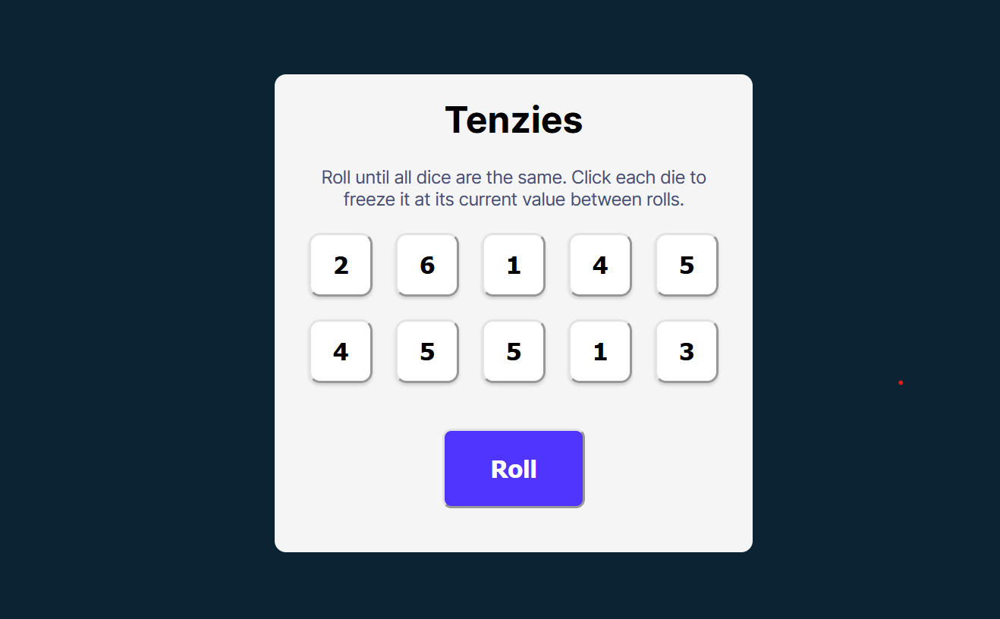

# Tenzies Game

This is a simple implementation of the Tenzies game using React. In Tenzies, the goal is to roll dice until all of them show the same number. You can hold dice to keep their values while rolling the others.<br>
I made this project while following the Learn React course on [scrimba.com](scrimba.com)

## Demo



[Live Demo](https://rushil-tenzies-game.netlify.app/)

## Features

- Roll dice to get matching values
- Hold dice to keep their values
- Track the number of rolls
- Timer to track the time taken to win

## Installation

To run this project locally, follow these steps:

1. **Clone the repository:**

    ```bash
    git clone https://github.com/RushilJalal/tenzies-game.git
    ```

2. **Navigate to the project directory:**

    ```bash
    cd tenzies-game
    ```

3. **Install the dependencies:**

    ```bash
    npm install
    ```

4. **Start the development server:**

    ```bash
    npm run dev
    ```

    The app should now be running on `http://localhost:5173`.

## Usage

- Click the "Roll" button to roll all dice that are not held.
- Click a die to toggle its "held" state, keeping its value between rolls.
- Continue rolling and holding dice until all dice show the same number.

## Contributing

Contributions are welcome! Please fork the repository and use a feature branch. Pull requests are gladly accepted.

1. Fork the repository
2. Create your feature branch (`git checkout -b feature/YourFeature`)
3. Commit your changes (`git commit -m 'Add some feature'`)
4. Push to the branch (`git push origin feature/YourFeature`)
5. Open a pull request


## Acknowledgements

This project is part of Learn React course on [scrimba.com](scrimba.com). 
